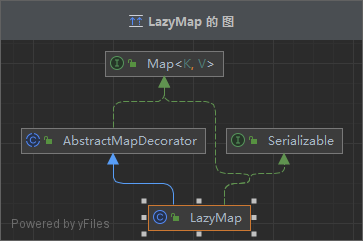
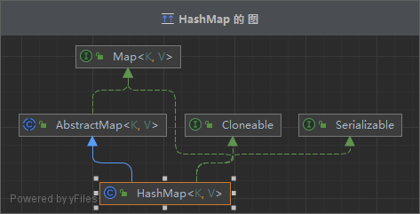
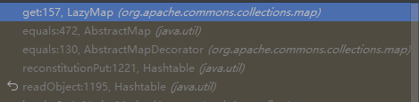

## 1.前言

必读：

[CC5](https://drun1baby.github.io/2022/06/29/Java%E5%8F%8D%E5%BA%8F%E5%88%97%E5%8C%96Commons-Collections%E7%AF%8707-CC5%E9%93%BE/#toc-heading-1)

[CC7](https://drun1baby.github.io/2022/06/29/Java%E5%8F%8D%E5%BA%8F%E5%88%97%E5%8C%96Commons-Collections%E7%AF%8708-CC7%E9%93%BE/)

---

**有了前面的基础，这里分析起来很快。**

**CC5 和 CC7 都可以看做是 CC1的替代版本，皆是替换掉 链头部分**


## **CC5**：

## 其实就是把CC1前面的链头部分（readObejct）换成别的了。所以说把CC1学好非常重要

**直接看【2 Java反序列化基础\链子流程图\全 CC 链流程.pdf】**

---

## CC7：

**我是从结果导向过程的，所以要边看代码边看分析过程** 【详情代码查看：CC7.java】


### 执行过程：

```java
Hashtable#readObject
	Hashtable#reconstitutionPut
```


`Hashtable#reconstitutionPut`：

```java
for (Entry<?,?> e = tab[index] ; e != null ; e = e.next) {
            if ((e.hash == hash) && e.key.equals(key)) {
                throw new java.io.StreamCorruptedException();
            }
        }
```

 **LazyMap结构：**




`Hashtable#reconstitutionPut`中,**key为LazyMap类型**,所以执行到`e.key.equals(key)`时,结合 **LazyMap结构** 查看得知，会跳转到**AbstractMapDecorator#equals(key)**。

`AbstractMapDecorator#equals(key)`会跳转到 `map.equals(object)`,其中**map为HashMap**。`HashMap`本身无`equals`方法，因此向上调用父类（`AbstractMap`）的`equals`方法，`AbstractMap#equals`调用`LazyMap#get`方法，连上链子，游戏结束。


**HashMap结构**：



有点绕？下断点在 Hashtable.java的1189行进行调试，附上整个执行的流程：

**（倒序）**




上面说的 【**key为LazyMap类型**，**map为HashMap】**，都是我们应该去构造的。

---

### 三个问题的解决：

​																																——[CC7](https://drun1baby.github.io/2022/06/29/Java%E5%8F%8D%E5%BA%8F%E5%88%97%E5%8C%96Commons-Collections%E7%AF%8708-CC7%E9%93%BE/)

tips1：

`Hashtable#reconstitutionPut`中，想执行`e.key.equals(key)`必须进入for循环。因此需要两个Hashtable对象调用put方法。


tips2：

**为什么调用的两次`put()`其中map中key的值分别为yy和zZ?**

为了执行 `Hashtable#reconstitutionPut` 中的 `if ((e.hash == hash) && e.key.equals(key))`语句：

```java
"yy".hashCode() == "zZ".hashCode()
```


tips3：

**为什么在调用完 `HashTable.put()` 之后，还需要在 decorateMap2 中 `remove()` 掉 yy？**

因为 `HashTable.put()` 实际上也会调用到 `equals()` 方法，会将键值添加到map中，导致后面实际利用时添加会出错，因此要remove掉