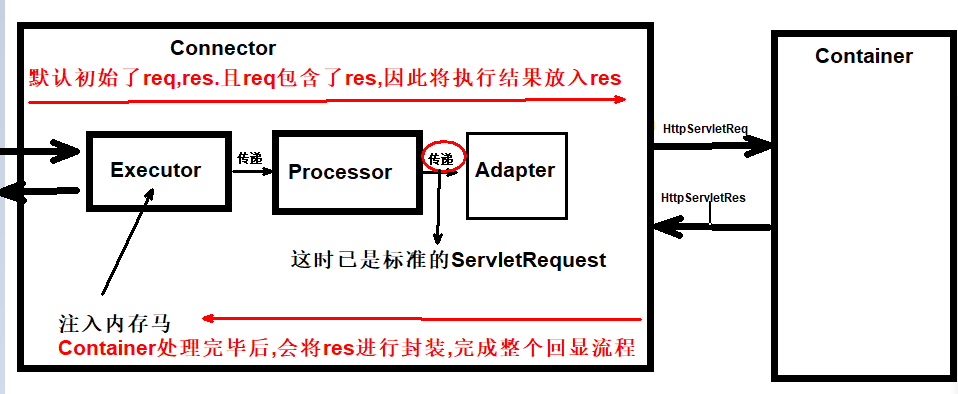

## 内存马

### Tomcat和Spring内存马分别有哪些（★）[+]

Tomcat内存马有：Filter型，Servlet型，Listener型

Spring内存马有：Controller型，Interceptor型

Java Agent内存马：这种方式不仅限于`Tomcat`或`Spring`

### Servlet/Filter内存马查杀手段是怎样的（★★★）[+]

直接能想到的办法是利用Java Agent遍历所有JVM中的class，判断是否是内存马

例如使用阿里的arthas分析，根据继承实现类黑名单，注解包名类名等黑名单来做

例如`LandGrey`师傅的`copagent`项目，根据黑名单和风险注解作为依据，

或者使用c0ny1师傅的`java-memshell-scanner`项目，从Tomcat API角度删除

### Filter内存马查杀时候有什么明显特征吗（★★★）[+]

首先是类名可能是恶意的，或者包名和项目名不符，可以一眼看出

其次优先级肯定是第一位的，这由内存马的特性决定，所以应该重点关注第一个Filter

观察ClassLoader是否是不正常的，以及是否存在对应的Class文件

### 如何实现无法删除的Servlet/Filter内存马（★★★★）[+]

有一种思路是在`destroy`方法中加入再注册内存马的代码，但并不是所有删除方式都会触发`destroy`方法

所以另外的思路是跑一个不死线程，循环检测该内存马是否存在，以及注册的功能

### 内存马如何持久化（★★★）

内存马持久化这个问题必须要往本地写文件，可以利用`addShutDownHook`方法在`JVM`退出时写文件

一般来说思路是写入依赖`Jar`中，例如`catalina.jar`中

4ra1n师傅提到的修改Tomcat的Lib也是一种手段，在默认开启的`WsFilter`中的`doFilter`方法中修改代码

### 内存马持久化写字节码方式除了`@Filter`标签还有什么办法（★★★）

使用`ServletContainerInitializer`用于在容器启动阶段注册三大组件，取代`web.xml`配置。其中`onStartup`方法会在`Tomcat`中间件重启加载当前`webapp`会优先执行这个方法。通过改方法，我们可以注册一个`webshell`的`filter`

### Java Agent内存马的查杀（★★★）[+]

网上师傅提到用`sa-jdi.jar`工具来做，这是一个JVM性能检测工具，可以dump出JVM中可能有问题的Class文件，尤其重点关注`HttpServletr.service`方法，这是Agent内存马常用的手段

### Java Agent内存马的查杀的难点是什么（★★★★）

一般Agent内存马会调用`Java Agent`提供的`redefineClass`方法加入内存马

如果想检测，拿到的字节码并不是修改过的字节码，而是原始字节码，因此无法判断某个类是否合法

准确描述：无法获取到被`redefineClass`修改后的字节码，只能获取到被`retransformClass`修改后的字节码

### Java Agent内存马通常Hook的点有哪些（★★★★★）

根据JavaEE规范，最先想到的点应该是`javax/servlet/http/HttpServlet#service`

其次是位于`Filter`链头部的`org/apache/catalina/core/ApplicationFilterChain#doFilter`

针对特殊框架可以做特殊处理，例如针对`Spring`的`org/springframework/web/servlet/DispatcherServlet#doService`

还有4ra1n师傅提出关于`Tomcat`自带`Filter`的修改：`org/apache/tomcat/websocket/server/WsFilter#doFilter`

### 查到Java Agent内存马那么应该如何杀（★★）[+]

这个比较简单，用`Agent`把查到的类对应的方法改成原始的字节码即可

获取原始字节码也不难，从本地或标准库中查找，然后利用`Javassist`修改

### 如果有一个陌生的框架你如何挖内存马（★★★）[+]

核心是找到类似`Tomcat`和`Spring`中的`Context`对象，然后尝试从其中获取`request`和`response`对象以实现内存马的功能。

可以从常见的类名入手：Requst、ServletRequest、RequstGroup、RequestInfo、RequestGroupInfo等等

可以参考c0ny1师傅的`java-object-searcher`项目，半自动搜索`request`对象

### 是否了解Spring Cloud Gateway如何注入内存马（★★★★）

参考`c0ny1`师傅的文章，由于`Spring Cloud Gateway`并不基于`Tomcat`而是基于`Netty`框架，需要构造一个`handler`用作内存马。另外的思路是构造上层的内存马，也就是基于`Spring`的内存马，向`RequestMappingHandlerMapping`中注入新的映射。具体代码使用到了`Sping`的一些工具类，在`SPEL`中反射调用了`defineClass`以达到执行代码的效果

### 谈谈Executor内存马（★★★）[+]

**基础原理：**

Tomcat中的service主要由Connector和Container组成，filter/listener/servlet型内存马实现过程都在Container中,那Connector中有没有内存马？答案是存在的，即Executor内存马。Connector主要分为EndPoint和Processor和Adapter。而Executor组件就存在于EndPoint中。

关键在于Executor组件有个executor.execute()方法，所以我们只需要重写executor.execute()方法即可实现恶意类，然后再通过AbstractEndpoint中的setExecutor⽅法将原本的executor置换为我们的恶意类,内存马就完成了.

**自定义传参：（比如想执行whoami）**

标准的ServletRequest需要经过Processor的封装后才可获得，如果我们想要把命令放在header中传入，该如何实现？

可以通过NioEndpoint中的nioChannels的appReadBufHandler，很明显其中的Buffer存放着我们所需要的request（估计还有别的类可以使用，待探索）

**实现回显：**

1.AbstractProcessor初始化了request,response

2.Response是会封装在Request对象中的

3.在Container中的逻辑处理完之后，Http11Processor会继续对我们的response进⾏封装

4.所以我们只需将命令执⾏的结果提前放⼊Tomcat的response中即可

**Executor内存马图示:**

