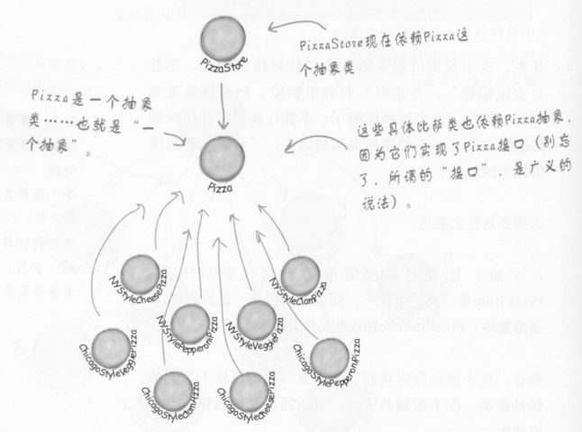
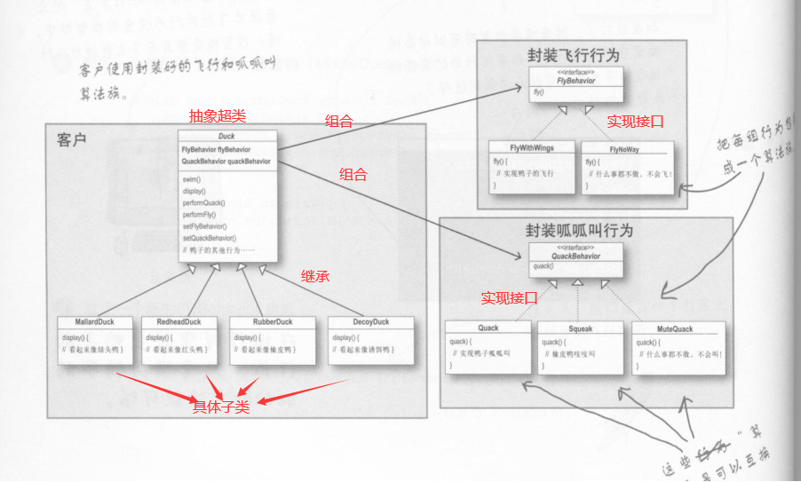
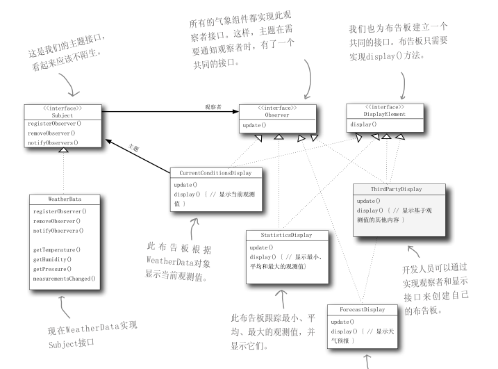
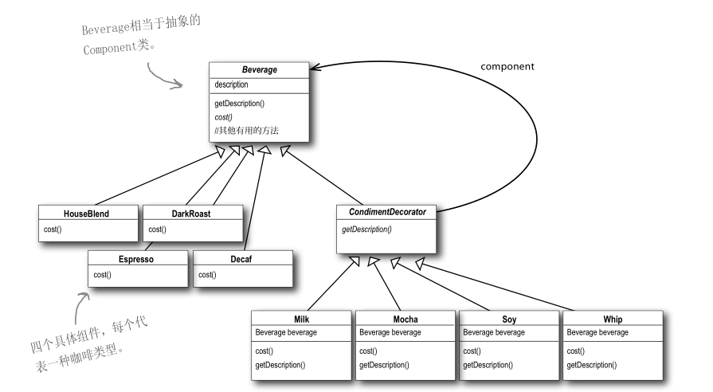
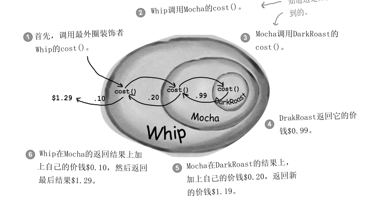
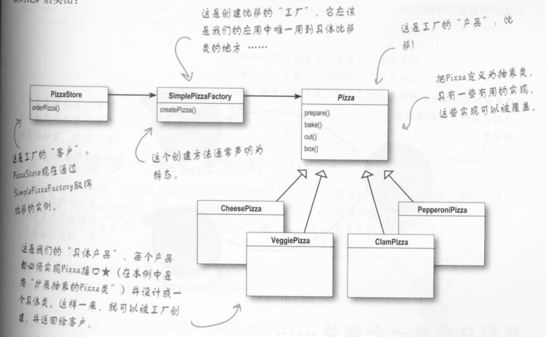

## 0.前言

参考书籍：《Head First 设计模式》，可自行在zlib上搜索下载电子书，或者孔夫子app十五块拿下。

参考链接：[设计模式 | 菜鸟教程](https://www.runoob.com/design-pattern/design-pattern-tutorial.html) 

​				  这个看UML图特别好： [设计模式](https://github.com/youlookwhat/DesignPattern)

【警告：由于设计模式需要程序员拥有大量编程的经历才可以更好的理解，个人并没有大量编程经验，所以个人的理解都来自于书籍，为避免大量复制粘贴只用图来快速回忆，想获取更详细的说明请参考我给的链接】

注意：虚线箭头为**实现接口**，实线箭头为**继承**。

分为两个板块：

**解释：**

**用法：**

---

## 1.设计原则

1.封装变化（分开变化和不会变化的部分，成为两个类）

2.多用组合，少用继承（将复杂问题解耦成多个块，分为两大块，一块"容易变化"，另外一块"不容易变化"）

3.针对接口编程，不针对实现编程（将共同的特性抽象出来成为接口）

4.为交互对象之间的松耦合设计而努力

5.对扩展开发，对修改关闭。

6.依赖倒置原则：依赖抽象，而不是具体类。（不能让高层组件依赖低层组件，**且高低层都应该依赖抽象**）

所谓的高层组件：由其他低层组件定义其行为的类，高层可以理解为金字塔的顶端，没有低层就没有高层。

【详见：依赖倒置原则图示】

### **1-6 依赖倒置原则图示**（高低层都依赖抽象）：

指导方针：（主要用于**经常改动**的地方，并不是随时要遵循这个原则）

- 变量不可以持有具体类的引用（不直接new 对象，改用工厂）
- 不要让类派生自具体类（也就是不用或少用继承，**用抽象类或接口**）
- 不要覆盖基类中已实现的方法（设计基类时要设计固定不变，持久应用的方法，旧的不用动，只专注于负责扩展新功能。基类中已实现的方法，应该由所有的子类所共享）

---

## 2.策略模式

**解释：**定义一系列的算法,把它们一个个封装起来, 并且使它们可相互替换。

**用法：**用于基本不变，但存在变化的结构。

组合你可以理解为现实生活中的 外包

---

## 3.观察者模式

**解释：**当主题有新数据时可选择**推送**给观察者或者观察者自行**拉取**(一般是推送)，观察者可自行退出或加入观察者模式。

**用法：**天气预报推送面板，微信公众号推送机制，报纸订阅推送系统

---

## 4.装饰对象

**解释：**动态地给一个对象添加一些额外的职责。可以理解为外包给外包1，然后叫外包1加点新代码，然后外包1也可以再外包给外包2 ...... 。

**用法：**咖啡店自定义搭配调料然后算钱。

还不理解装饰对象是如何外包的？，看图：

DarkRoast外包给Mocha,Mocha外包给Whip,**且都不能动你上级的代码**（谁叫上级是甲方，上级外包给你，你拿钱就得听话不能说上级给的需求做不了）

---

## 5.工厂模式

**解释：**定义一个创建对象的接口，但由子类决定要实例化的类是哪一个。工厂方法让类把**实例化推给到子类**。

**用法：**用于专门生产对象，并返回。（创建一个产品）

用继承来实现，利用工厂方法创建对象，需要扩展一个类，并覆盖它的工厂方法。

---

## 6.抽象工厂

**解释：**提供一个接口，用于创建相关或依赖对象的家族，而不需要明确指定具体类。

**用法：**用于创建**产品家族**

通过对象的组合实现，提供一个用来创建一个产品家族的抽象类型，这个类型的子类定义了产品被产生的方法。要想使用这个工厂，必须先实例化它，然后将它传入一些针对抽象类型所写的代码中。
