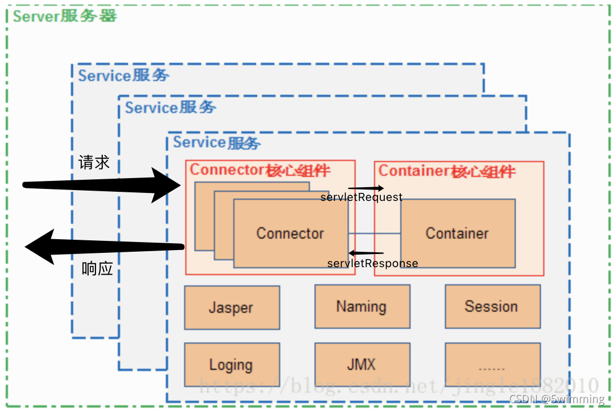
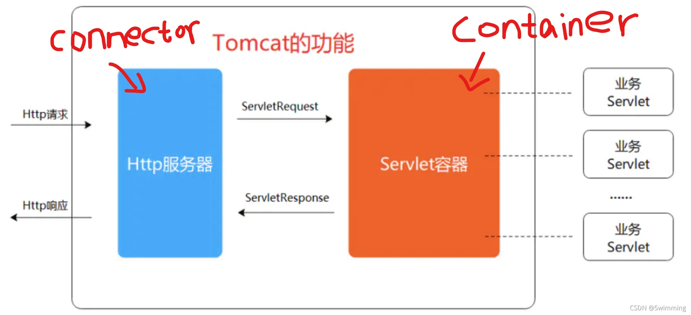
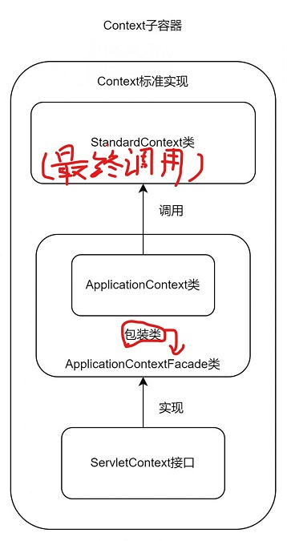
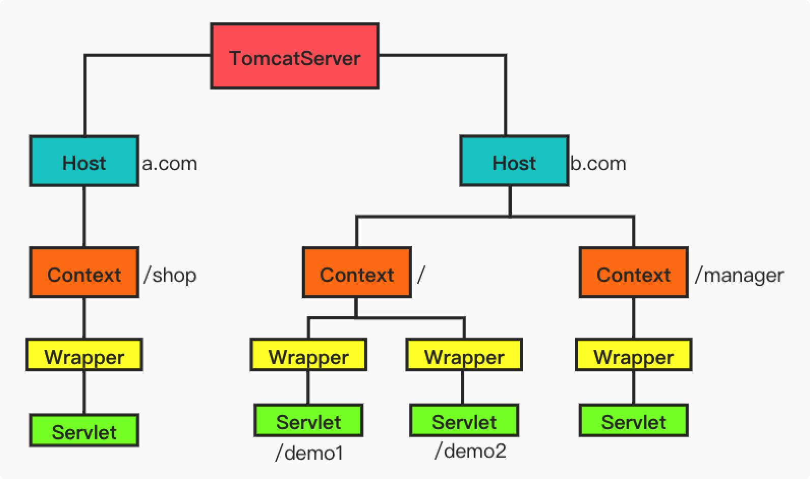

## 1.前言

必读:

[Shell中的幽灵王者—JAVAWEB 内存马 【认知篇】](https://mp.weixin.qq.com/s/NKq4BZ8fLK7bsGSK5UhoGQ)(**05 技术性攻防延展**先不用看,也看不懂)

[Java内存马系列-01-基础内容学习](https://drun1baby.top/2022/08/19/Java%E5%86%85%E5%AD%98%E9%A9%AC%E7%B3%BB%E5%88%97-01-%E5%9F%BA%E7%A1%80%E5%86%85%E5%AE%B9%E5%AD%A6%E4%B9%A0/)(看完)

这种概念的东西很容易相互抄,我只能通过目录让脉络更清晰一点,完整版看原文.

---

## java web架构

```md
java web架构:
					
客户端 (http协议)--> 服务端(listener -> n*filter(顺序执行 1->2->3) -> servlet -> Database)
客户端	(http协议)<-- 服务端(listener -> n*filter(逆序执行 1<-2<-3) <- servlet <- Database)	
```
## Java Web三大组件

### servlet

#### 通信过程

```md
客户端:
1.客户端 发起请求(get/post)--> 服务端

服务端:
1.servlet容器接受到请求,封装成对应的HttpServletRequest和HttpServletRespose
2.调用init(),类似于java中的构造函数
3.调用service() (包含get类型和post类型,根据客户端所发起的类型选择,是get类型就在service()内执行doGet(),post类型同理)
4.doGet()/doPost() 中都是我们自己写的业务逻辑
5.doGet()/doPost() 执行完后,将执行结果返回给servlet容器,servlet容器再返回客户端
6.关闭容器时,执行destory() (类似于C++的析构函数)
```


#### servlet生命周期

```md
1.服务器启动时或第一次请求该servlet时,会初始化servlet对象(也就是执行init() )
2.servlet对象去处理所有客户端请求(通过执行service() )
3.服务器关闭时,销毁servlet对象(也就是执行destroy() )
4.JVM垃圾回收
```

---

### Filter

顾名思义,是个过滤器,**能对request和response进行过滤,处理和添加功能**.你可以理解为设计模式中的代理模式.

[Filter详解](https://blog.csdn.net/m0_51545690/article/details/123677340)


#### 工作原理

- 用伪代码理解

```java
int main(){

	servletHandler(request,response,FilterChain){ 
        // FilterChain[]内的代码为可选部分,FilterChain是个数组,内含多个filter
		FilterChain[
            
        // 所属 /xx1 ,如 /getDouble 当客户端执行 www.domain.com/getDouble时触发 
        filter-1(request-1,response-1); 
        // 所属 /xx2 ,如 /getFloat,与上同理
        filter-2(request-2,response-2); 
        ... 
        filter-maxLength(request-maxLength,response-maxLength); 
            
        ]    
        
        servlet(request,response);
	}

	filter-num(request,response){
        doFilter(request,response);
		
		return request,response;
	}
    
	doFilter(request,response){
        // 当 request.content/response.content 被我们自定义过滤了,则退出
        if(request.content/response.content == Error){
            exit;
        }
        
        if(request.num/response.num == maxLength){
            // 前添加恶意代码
            FilterChain.doFilter(
                servlet.service();
            );
        	// 后添加恶意代码
        }
 
		return request,response;
	}
}
```

- 文字理解

  1、Filter 程序是一个实现了特殊接口的 Java 类，与 Servlet 类似，也是由 Servlet 容器进行调用和执行的。

  2、当在 web.xml 注册了一个 Filter 来对某个 Servlet 程序进行拦截处理时，它可以决定是否将请求继续传递给 Servlet 程序，以及对请求和响应消息是否进行修改。

  3、当 Servlet 容器开始调用某个 Servlet 程序时，如果发现已经注册了一个 Filter 程序来对该 Servlet  进行拦截，那么容器不再直接调用 Servlet 的 service 方法，而是调用 Filter 的 doFilter 方法，再由  doFilter 方法决定是否去激活 service 方法。

  4、但在 Filter.doFilter 方法中不能直接调用 Servlet 的 service 方法，而是调用  FilterChain.doFilter 方法来激活目标 Servlet 的 service 方法，FilterChain 对象时通过  Filter.doFilter 方法的参数传递进来的。

  5、只要在 Filter.doFilter 方法中调用 FilterChain.doFilter 方法的语句前后增加某些程序代码，这样就可以在 Servlet 进行响应前后实现某些特殊功能。

  6、如果在 Filter.doFilter 方法中没有调用 FilterChain.doFilter 方法，则目标 Servlet 的 service 方法不会被执行，这样通过 Filter 就可以阻止某些非法的访问请求。

  

​																															——[Java内存马系列-01-基础内容学习](https://drun1baby.top/2022/08/19/Java%E5%86%85%E5%AD%98%E9%A9%AC%E7%B3%BB%E5%88%97-01-%E5%9F%BA%E7%A1%80%E5%86%85%E5%AE%B9%E5%AD%A6%E4%B9%A0/)

---

#### Filter的生命周期

```md
(1-1.根据web.xml知道需要初始化的filter对象,1-2.执行对应filter的init() )
1.服务器启动时,会初始化各个Filter对象,初始化完毕会驻留内存
2.Filter对象会去 过滤/处理/添加 所有客户端请求(通过执行doFilter() )
3.服务器关闭时,销毁Filter对象(也就是执行各个Filter对象的destroy() )
4.JVM垃圾回收
```

---

### Listener

对 Application,Session,Request 这三个对象的操作**(如:创建,销毁,添加)**进行监听，监听到对应的操作**(如:创建,销毁,添加)**就执行相应的触发方法.

类似于  JVM中的**清除直接内存**的实现过程(通过虚引用实现)

---

## Tomcat

#### Tomcat通俗解释

Apache : 静态页面,返回皆是html,**无法动态解析/运行**用户输入

Tomcat : 动态页面,基于jsp,**可以动态解析/运行**用户输入


**本质上是一个servlet容器，只不过可以基于这个容器(Tomcat)去运行其他的servlet**


#### Servlet容器架构

```md
(从上到下)
Engine	↓
Host    ↓
Context ↓
Wrapper ↓
```


#### Tomcat架构



看图可知，

- Tomcat只有一个Server,这个Server中有多个service.
- 外部可通过某个接口去访问Tomcat Server
- Tomcat Server会维护所包含的所有service,包括初始化，结束等各种操作
- Tomcat Server中至少有一个service,用于提供具体服务
- Tomcat 的心脏是两个组件：Connector 和 Container
  - Connector 主要负责对外交流，进行 Socket 通信(基于 TCP/IP)，解析 HTTP 报文，对应下图中的http服务器；
  - Container 主要处理 Connector 接受的请求，主要是处理内部事务，加载和管理 Servlet，由 Servlet 具体负责处理 Request 请求，对应下图中的 servlet 容器。



##### Service

一个Service可以设置多个 Connector,但只有一个 Container容器


##### Connector

- 1.接受客户端发送的tcp请求
- 2.接着创建 Request和Response 
- 3.**封装** "Request和Response" 成 "ServletRequest和ServletResponse" ,**用于在Connector和Container之间进行通信**
- 4.创建一个新线程来处理 ServletRequest和ServletResponse(**传给Container来处理**)

组成部分:

- EndPoint
- Processor
- Adapter

简而言之，这三部分的作用是将**tcp请求/响应 对象** 转换为能在**Tomcat中通信的**

**对象**(ServletRequest/ServletResponse)


##### Container

容器的父接口，所有子容器必须实现这个接口


组成部分:(**[]内的内容为主体所包含的**)

- Engine[Host]
  - Engine: 最顶层容器组件，可以包含多个 Host。实现类为 `org.apache.catalina.core.StandardEngine`
  
- Host[Context]
  - Host: 代表一个虚拟主机，每个虚拟主机和某个域名 Domain Name 相匹配，可以包含多个 Context。实现类为 `org.apache.catalina.core.StandardHost`
  
- Context[Wrapper]
  - Context: 一个 Context 对应于一个 Web 应用，可以包含多个 Wrapper。实现类为 `org.apache.catalina.core.StandardContext`
  
  - Context详解:
  
    (`StandardContext`是Tomcat中负责与底层交互的Context)
  
  
  
- Wrapper
  - Wrapper: 一个 Wrapper 对应一个 Servlet。负责管理 Servlet ，包括 Servlet 的装载、初始化、执行以及资源回收。实现类为 `org.apache.catalina.core.StandardWrapper`
  
    


###### **Tomcat容器图示**



依图可知：

- **通常**一个 Servlet class 对应一个 Wrapper
- Context 指独立的一个 Web 应用地址
- servlet 绑定的是 WebServlet 地址
- 同一 Context 下的 不同Wrapper 地址自然也不同

---

## Tomcat类加载机制

(**非纯**双亲委派机制)

- 1.先使用 ExtClassLoader（使用双亲委托机制）去加载**(防止覆盖核心类)**

- 2.每个 WebApp 用一个独有的 ClassLoader 实例来**优先**处理加载。**(为了隔离webApp)**

- 3.这个ClassLoader 首先尝试自己加载某个类，如果找不到再交给父类加载器，其目的是优先加载 WEB 应用自己定义的类。

  
