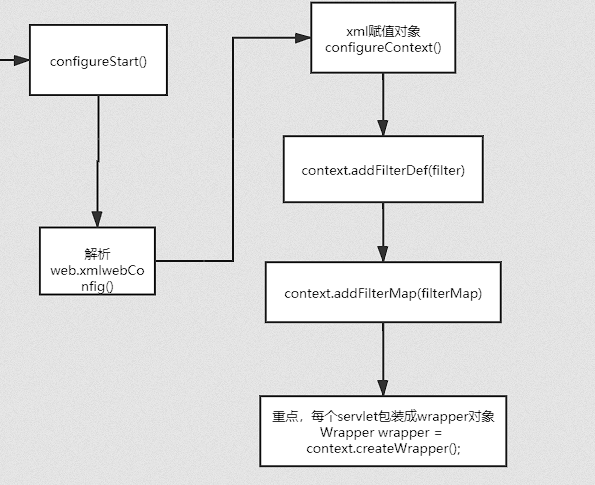
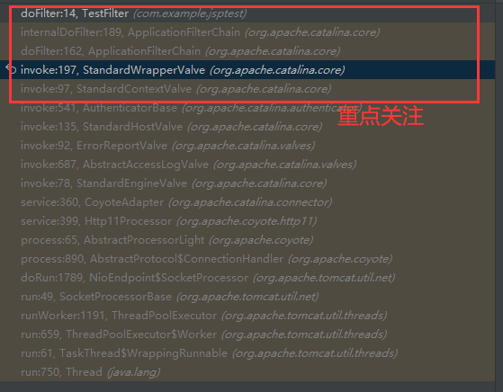
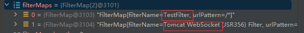
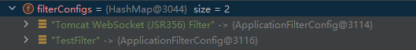

## 前言

必读:

[新版IDEA创建Java web工程时找不到Java Enterprise](https://blog.csdn.net/m0_67401761/article/details/124891981)

[JSP基础](https://drun1baby.top/2022/08/21/Java%E5%86%85%E5%AD%98%E9%A9%AC%E7%B3%BB%E5%88%97-02-%E5%86%85%E5%AD%98%E9%A9%AC%E4%BB%8B%E7%BB%8D/#toc-heading-1)(**"Tomcat 中的三个 Context 的理解"**看的有点懵逼)

[Servlet 项目搭建](https://drun1baby.top/2022/08/22/Servlet-%E9%A1%B9%E7%9B%AE%E6%90%AD%E5%BB%BA/)(只看第一种方法,没有Java Enterprise就看有没有Jakarta EE)

[Tomcat 内存马（二）Filter型](https://xz.aliyun.com/t/10362#toc-1)（详情代码调试查看此文章）

---

tmd,环境配置配到我想死，搜好多解决方案都解决不了tomcat 404错误

最后解决了，切记：

**不行就换tomcat版本！，切记要没用过的tomcat，我一直用之前学习jsp免杀的tomcat环境结果一直搭建不了，一换tomcat环境一下子就好了，我真的气死**

---

我所使用的版本：

**tomcat 9.0.65**


pom.xml

```xml
 <dependencies>
        <dependency>
            <groupId>javax.servlet</groupId>
            <artifactId>javax.servlet-api</artifactId>
            <version>4.0.1</version>
            <scope>provided</scope>
        </dependency>
        <dependency>
            <groupId>org.junit.jupiter</groupId>
            <artifactId>junit-jupiter-api</artifactId>
            <version>${junit.version}</version>
            <scope>test</scope>
        </dependency>
        <dependency>
            <groupId>org.junit.jupiter</groupId>
            <artifactId>junit-jupiter-engine</artifactId>
            <version>${junit.version}</version>
            <scope>test</scope>
        </dependency>
        <dependency>
            <groupId>org.apache.tomcat</groupId>
            <artifactId>tomcat-catalina</artifactId>
            <version>8.5.81</version>
        </dependency>
        <dependency>
            <groupId>org.apache.tomcat.embed</groupId>
            <artifactId>tomcat-embed-el</artifactId>
            <version>8.5.81</version>
        </dependency>
    </dependencies>
```

---

## Filter基础使用

【具体代码参考：TestFilter.java】

---

## Filter内存马核心诉求

1.用jsp写一个servlet

2.注册进tomcat

---

[Tomcat整理流程图](https://blog.csdn.net/u010883443/article/details/107463782)(**关注解析 web.xml的部分**)：




**ContextConfig**：`org/apache/catalina/startup/ContextConfig.java`

---


**懒加载**：只有用到对应的servlet才会生成对应的servlet对象

**预加载：**有别于懒加载，顾名思义为提前加载servlet对象


## Filter 内存马加载调试

（下断点在 **TestFilter#doFilter**）


调试如下：




调试过程直接看：[Tomcat 内存马（二）Filter型](https://xz.aliyun.com/t/10362#toc-1)，不再赘述

---

## Filter内存马核心构造

【Filter内存马核心诉求】中提到：

> ​	1.用jsp写一个servlet

> ​	2.注册进tomcat

1.没啥好说的，实例化一个servlet对象即可

2.我们需要去恶意控制 filterMaps 和 filterConfigs,filterDef,去注册filter**(通过反射去实现)**


【具体代码参考：FilterMemShell.java】（先把此md看完先，再去看代码，建议自己写一遍）

---

## Filter调试结果分析

Filter的使用过程：

- 1.从FilterChain中依次取Filter，最后一个Filter调用servlet.service()

Filter的创建过程：

- 1.创建 filterChain:(`org/apache/catalina/core/StandardWrapperValve.java` 87行)

  ```java
  ApplicationFilterChain filterChain =
          ApplicationFilterFactory.createFilterChain(request, wrapper, servlet);
  ```

  跟进去看一下,自行调试，可以发现核心逻辑：

  - filterMaps中为filter集合，里面保存的不是实际的实体，而相当于是JVM中的虚连接(也就是只是个引用)

    

  - filterConfigs中为实际过滤器

    


既然我们需要 filterMaps 和 filterConfigs,filterDef 这三个变量,那我们就看看**如何可控他们**

### 控制三个参数

#### fileterMaps

```
StandardContext#addFilterMapBefore
StandardContext#addFilterMap
```

#### filterConfigs

```md
StandardContext#filterStart
```

#### filterDef 

```md
StandardContext#addFilterDef
```

因此，分析完毕，我们只需要使用反射去调用和修改这三个参数，就能达到自定义注册filter的目的,达到自定义filter的目的后，我们自定义filter的doFilter方法为恶意即可。

